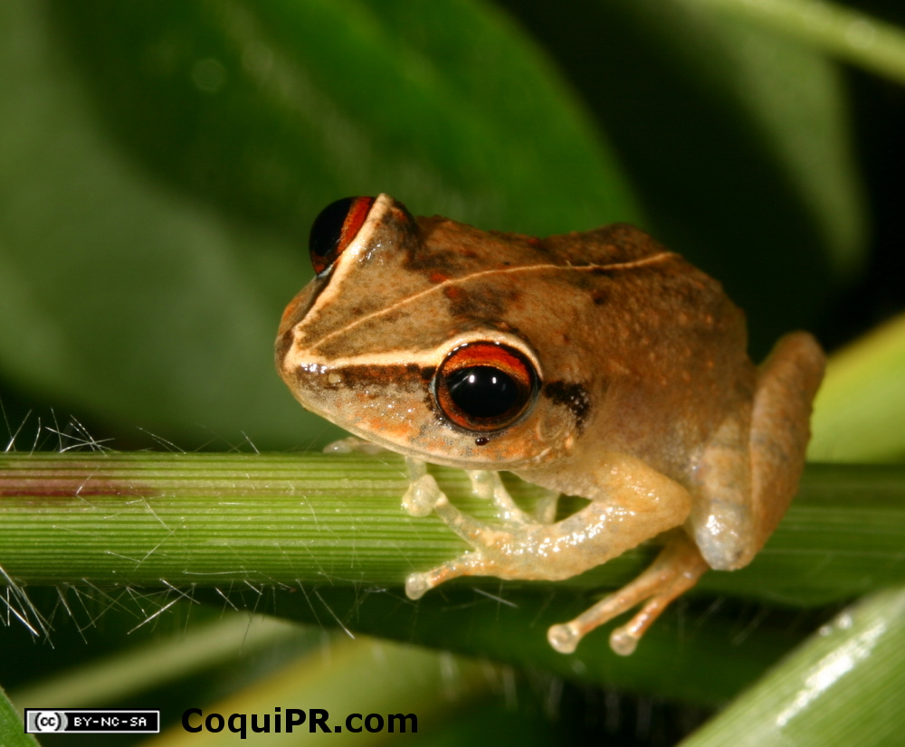

--- 
title: "Intro to Markdown"
author: "Luis Yasiel Colón Dávila" 
date: "`r format(Sys.time(), '%Y-%b-%d, %I:%M %p')`"
output: 
  prettydoc::html_pretty: 
  theme: cayman
  highlight: github
---


```{css, echo=FALSE}
.page-header {
  background-image: none !important;
  background-color: #719052 !important;
}
body {
  background-color: #E1EFC2 !important;
}
```


```{r, echo=TRUE, warning=TRUE, message=FALSE}


```


# Sobre Mi 


  


### __Me llamo Luis Y. Colón Dávila:__ 


Soy estudiante graduado cursando el programa de Maestria en Biologia.
Estoy interesado en seguir una carrera de investigacion por lo que mis metas son terminar un doctorado.
Entre mis intereses de investigacion me atrae el estudio de comportamiento y bioacustica al igual que la conservacion. <br> 
Actualmente mis preguntas estan dirigidas hacia la herpetologia, especificamente las serpientes. sin embargo estoy interesado en tener experiencia estudiando distintos grupos de animales fuera de los anfibios y reptiles.
<br> <br> <br> <br>

